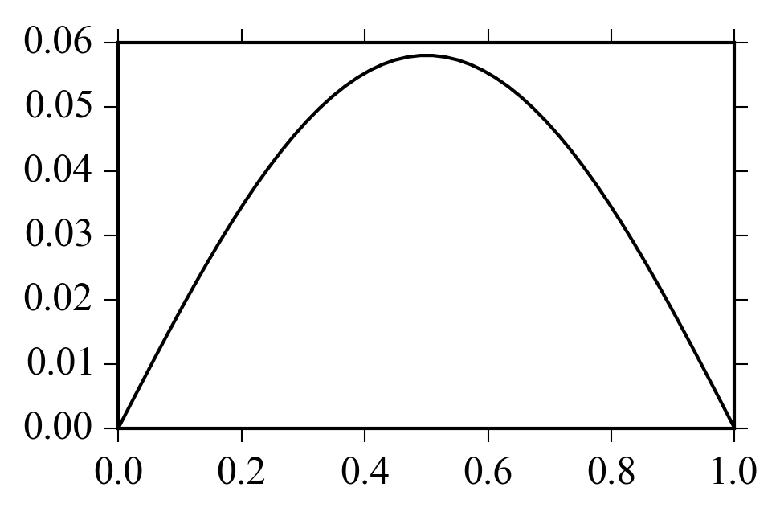

SymPy
=====

Implementing the Galerkin Method for solving differential equations
-------------------------------------------------------------------

.. note:: This material was taken from a presentation of the Technical
          University Bochum, from Yijian Zhan and Ning Ma

Consider the following differential equation:

.. math::
    D(y(x)) = y''(x) + y(x) + 2x(1-x) = 0

with boundary conditions:

.. math::
    y(0) = 0
    \\
    y(1) = 0

One can choose the approximation functions that will cope with the boundary
conditions:

.. math::
    y(x) \approx \phi_0(x) + \sum_i^n{c_i \phi_i (x)}

In the Galerkin approach the following integral is solved:

.. math::
    \int_a^b \phi_i[D(u)]dx = 0
    \\
    \int_a^b \phi_i(x) D[\phi_0(x) + \sum_j^n{c_j\phi_j(x)}]dx = 0

Since the current differential equation can be written as:

.. math::
    D_{left} = D_{right}
    \\
    D_{left} = y''(x) + y(x)
    \\
    D_{right} = -2x(1-x)

The Galerkin'n integral may be rearranged as:

.. math::
    \int_a^b \phi_i[D_{left}(u)]dx = \int_a^b \phi_i[D_{right}(u)]dx

which, when substituting the approximations, will result in the following
system of equations:

.. math::
    A_{ij} c_j = B{i}

Using the following approximation function:

.. math::
    y(x) \approx 0 + \sum_i^n{c_i x^i (x-1)^i}

the following Python code can be used:

.. literalinclude:: galerkin_example.py

giving:

